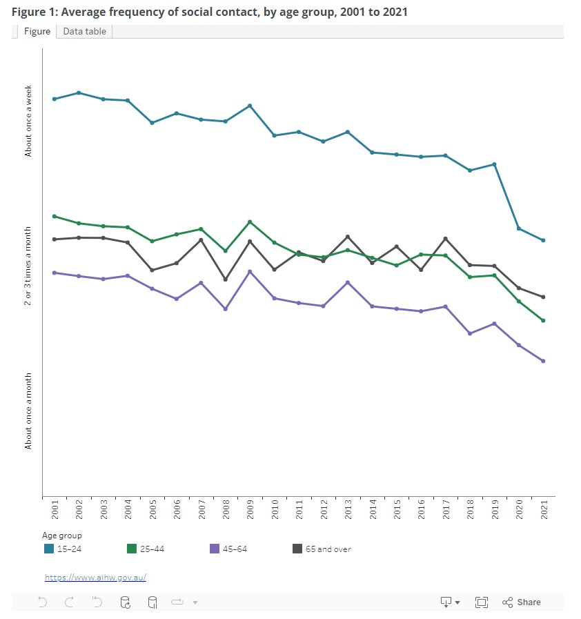

# API Webserver Project
## "Pick-Up" Team Builder

### Installation and Setup

--
### R1 Problem Identification
--
If you’ve ever played social team sports, you’ll know how tough it can be to get everyone to communicate whether they’re available each week. There are a few reasons for this, apart from the obvious heel-draggers who will always cause team admins to pull their hair out, there’s no easy way to create and manage a team for social sports leagues. 

Some simple solutions use social media to create polls or ask for a show of hands so to speak. Then there’s the old method of starting a group chat and texting everyone days before the game. All of these solutions are cumbersome and require tedious management. There could be a more effective solution for something that seems quite simple. 

This app aims to address the following problems:

- Organisation and Scheduling: One primary challenge in managing sports teams and leagues is organising games and schedules. The app will provide a platform for creating and managing schedules, allowing players and teams to know when and where games are happening.

- Team Formation and Management: Assist in forming teams by allowing players to sign up, express their skill levels, and availability. This can help in balancing teams and ensuring that each team has the required number of players.

- Player Communication: Effective communication is crucial for coordinating games. The app can facilitate communication between team admins and their players through emails for game reminders and scheduling.

- Attendance Tracking and Player Availability: Keeping track of who is attending upcoming games is vital for ensuring that games can go ahead. The app could allow players to RSVP to games and provide visibility to others on who will be attending.

- Scorekeeping: For league organisers interested in tracking progress and performance, the app could offer scorekeeping for teams.
--
### R2 Why is it a problem that needs solving?
--
The challenges associated with organising and managing pick-up sports teams and leagues are significant problems. 

- Anxiety and Depression: Even 3 and a half years after the pandemic first hit, concerns about mental health and substance abuse have been elevated. According to the World Health Organisation (June 2022), “Young people have been left vulnerable to social isolation and disconnectedness which can fuel feelings of anxiety, uncertainty and loneliness and lead to affective and behavioural problems.” Regular exercise is proven to be effective in reducing anxiety and depressive symptoms by releasing endorphins and serotonin which can improve mode.

- Health and Fitness Promotion: The physical benefits of social sports and regular exercise are also problems that need addressing. Regular exercise can help prevent and manage stroke, metabolic syndrome, high blood pressure, type 2 diabetes, depression, anxiety, many types of cancer, and arthritis.

- Build friendships through socialisation. According to the Australian Institute of Health and Welfare (2022) social contact survey (see attached), interactions have been steadily declining since 2001. The most notable drop occurred in young adults ages 15-24. The app makes it easier to find connections in competitive or non-competitive settings. Promoting inclusivity and accessibility to people who may feel nervous about joining a league.

- Time and Resources: Without a centralised system, organising games can be time-consuming and inefficient, often relying on disjointed communication methods like social media, emails, or word-of-mouth. The app streamlines this process, saving time and making it easier for players to engage in activities.

- Accessibility and Inclusivity: Many people are interested in participating in sports but face barriers in accessing organised games or teams. Democratising access to sports by making it easier for individuals of all skill levels to find and join local games, and will foster a more inclusive community.

- Centralise Data: Creating a centralised system for storing users, teams, and league data will reduce redundancies, improve data integrity, add valuable insights, and reduce running costs. 

- Player Management: Without a system to match players by position and skill level, games can become unbalanced, leading to a less enjoyable experience. An app that considers skill levels and availability ensures more balanced and enjoyable games.

- Consistency and Commitment: Spontaneous or irregular sports games can lead to low commitment levels, resulting in games being cancelled or played with insufficient participants. A dedicated platform enhances commitment by providing structured schedules and reminders.

Solving these problems is essential for making sports more accessible, enjoyable, and safe, while also promoting health, fitness, and community engagement. The Team Builder app has the potential to significantly enhance the experience of participating in local sports, making it a valuable tool for individuals and communities alike. On the other hand, it provides beneficial management for administrators who need to deal with large sets of data.

--
### R3 Why have you chosen this database system. What are the drawbacks compared to others?
--
PostgreSQL was chosen because ...
--
### R4 Identify and discuss the key functionalities and benefits of an ORM
--

--
### R5 Document all endpoints for your API
--

--
### R6 An ERD for your app
--

--
### R7 Detail any third party services that your app will use
--

--
### R8 Describe your projects models in terms of the relationships they have with each other
--

--
### R9 Discuss the database relations to be implemented in your application
--

--
### R10 Describe the way tasks are allocated and tracked in your project
--

--